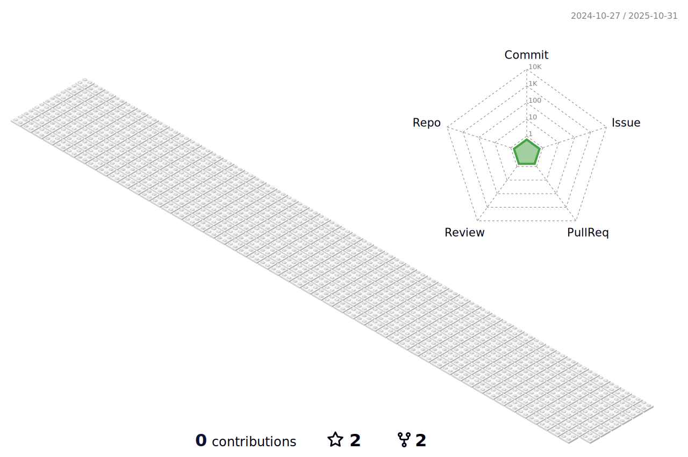

## Salutations, everyone!
##

<!---------------------------------- Gif ------------------------------------------>

<!-------------------------------- Short Bio -------------------------------------->

<ul align="left">
    <li>✨ My passion lies in utilizing online tools and technology to infuse creativity into my work and continually advance my skills and expertise. </li>
    <li>🧡 I've devoted myself to refining my design abilities, and UX, and becoming proficient in design software like Adobe XD, Figma, Canva, and various online studios and tools. </li>
    <li>💻 In addition to my design practice and knowledge, especially UI and Graphic design, I have practiced programming languages like HTML, CSS, JavaScript, React.js, and Java, which I'm continuously learning and applying, which I'm continuously learning and applying.</li>
    <li>🍁 My knowledge spans beyond design, encompassing areas such as   Digital Marketing,   IT Project Management,   Content Writing and Designing,   research Writing,   AI, and   Blogging.</li>
    <li>🤓 Currently, I'm completely diving into the world of UX, specifically UI, and Frontend. I'm actively developing my skills in editing platforms and design studios. My focus is on crafting engaging website interfaces and designs that truly grab users' attention and connect with them.
My present focus lies in exploring in-depth Product Design, innovating new product concepts, translating them into designs, and working to contribute to diverse communities and teams. My attributes of patience, loyalty, diligence, and proactivity highlight how I tackle any task. My ultimate aspiration is to employ my unique skill set, innovative methodologies, and visionary mindset to make a meaningful and impactful contribution to a forward-thinking organization.</li>
</ul>

<!---------------------------------Frameworks, Languages & Other Tools ------------------------------------->        
        
## ⚛️ Frameworks, Languages & Other Tools        
 

         
        
        
        
        
        
        
        
        
        
        
        
        
        

<!------------------------------------------------ Github Stats ------------------------------------------------>

## 🌟 Github Stats

<!---------------------------------------------- 3D Contribution Graph ----------------------------------------->

